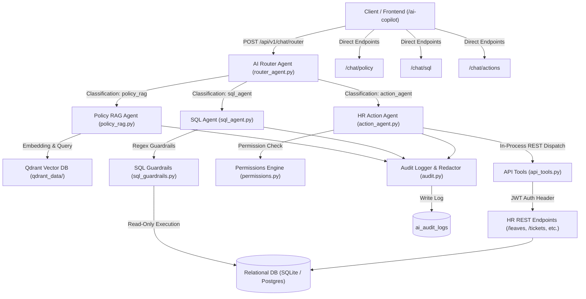

# NovaWorks PeopleOps Copilot — AI Architecture & Design Specifications

> Document Version: 1.0.0  
> System: NovaWorks HR Copilot  
> Target Architecture: Multi-Agent AI System with Role-Based Access Control, Guardrails, and RAG  

---

## 1. System Overview & Component Architecture

NovaWorks PeopleOps Copilot is an enterprise-grade AI assistant designed to automate HR policy inquiries, employee database queries, and administrative HR actions. The system is designed with strict security, auditability, and role-based access control (RBAC).



---

## 2. LLM & Provider Abstraction Layer

The system uses a factory design pattern (`LLMFactory`) to support seamless switching between LLM providers (Dell AI Gateway, OpenAI, Google Gemini, or Mock Provider for local testing/evaluations) without modifying service layer logic.

### Provider Interface Contract
- **Supported Providers**: `OPENAI` (`gpt-4o-mini`, `gpt-4o`), `DELL_GATEWAY` (Enterprise Gateway Proxy), `GEMINI` (`gemini-1.5-flash`), `MOCK` (Deterministically structured fallbacks).
- **Fallback Strategy**: If primary provider fails or rate-limits, the factory automatically fails over to secondary configured LLM endpoints.

---

## 3. Core AI Agent Specifications

### A. Intent Router Agent (`router_agent.py`)
- **Purpose**: Classifies user query into one of three domain agents (`policy_rag`, `sql_agent`, `action_agent`) or `none`.
- **Classification Latency**: ~150ms.
- **Endpoint**: `POST /api/v1/chat/router`

### B. Policy RAG Agent (`policy_rag.py`)
- **Purpose**: Answers HR policy questions using grounded retrieval over company policy documents.
- **Vector Database**: Qdrant embedded mode (`qdrant_data/`) using cosine similarity.
- **Embedding Model**: `BAAI/bge-small-en-v1.5` (384 dimensions) via SentenceTransformers.
- **Hallucination Prevention**: If retrieval score is below threshold (0.45), returns explicit fallback statement: *"I'm sorry, I don't have enough information in the HR policy documents to answer that question."*
- **Endpoint**: `POST /api/v1/chat/policy`

### C. SQL Agent & Guardrails (`sql_agent.py` & `sql_guardrails.py`)
- **Purpose**: Converts natural language into SQLite/PostgreSQL read-only queries for employee, project, skill, and department inquiries.
- **Security Blocklist**: Immediately rejects any SQL containing `INSERT`, `UPDATE`, `DELETE`, `DROP`, `ALTER`, `CREATE`, `REPLACE`, `TRUNCATE`, `PRAGMA`, `ATTACH`, `DETACH`.
- **Sensitive Field Redaction**: Protects sensitive columns (`hashed_password`, `current_salary_usd`, `bank_account_number`, `pan_number`).
- **Endpoint**: `POST /api/v1/chat/sql`

### D. HR Action Agent (`action_agent.py` & `api_tools.py`)
- **Purpose**: Executes operational HR tasks (applying leaves, creating IT tickets, approving leaves, assigning projects, publishing announcements).
- **Architecture Requirement**: **Zero Direct DB Writes**. The Action Agent dispatches requests exclusively via authenticated FastAPI REST endpoints (`httpx.ASGITransport`) using the caller's JWT token.
- **Role Enforcement**: Operates under strict permissions (`permissions.py`). Action requests violating caller role permissions are rejected with `DENIED` status.
- **Endpoint**: `POST /api/v1/chat/actions`

---

## 4. Audit Logging & Redaction (`audit.py`)

Every interaction across all endpoints is logged to `ai_audit_logs` table:
- **Redaction Engine**: Automatically redacts PAN card numbers, bank account numbers, passwords, and sensitive monetary amounts before saving `query_text` or `response_text` to the database.
- **Captured Metadata**: `employee_id`, `agent_type`, `query_text`, `response_text`, `action_taken`, `tool_called`, `timestamp`.

---

## 5. Design Decisions Log

This section records structural decisions, trade-offs, and architecture choices made during development:

| # | Decision | Chosen Approach | Rationale | Alternatives Considered |
|---|---|---|---|---|
| 1 | **Authentication** | Minimal JWT Auth from scratch (`jose` + `passlib`) | Lightweight, self-contained, easy to integrate with FastAPI dependencies and test tokens. | OAuth2 / Auth0 (Overkill for MVP context) |
| 2 | **Vector Database** | Embedded Qdrant (`qdrant_data/`) | Zero external container dependency during development; easily migrates to ChromaDB / Qdrant Cloud for production. | FAISS (Lacks native metadata filtering), Pinecone (Cloud required) |
| 3 | **Database Strategy** | SQLite (Dev) → PostgreSQL / RDS (Prod) via Alembic | Instant local setup with zero friction; Alembic migrations guarantee seamless migration to RDS PostgreSQL. | PostgreSQL locally (Requires local Docker/Postgres daemon) |
| 4 | **Action Agent Execution** | In-Process REST API Dispatch (`httpx.ASGITransport`) | Guarantees 100% API validation and RBAC enforcement without duplicating business logic or allowing raw DB writes. | Direct DB SQLAlchemy writes (Violates assignment constraint) |
| 5 | **Design Decision Section** | Formal section inside `docs/ai_architecture.md` | Keeps architecture, design rationale, and system contracts consolidated in a single authoritative document. | Separate `DECISIONS.md` file |

---

## 6. Setup Instructions & Environment Variables

### Requirements
- Python 3.10+
- Virtualenv `.venv`

### Environment Configuration (`.env`)
```env
PROJECT_NAME="NovaWorks PeopleOps Copilot"
SECRET_KEY="your-jwt-secret-key"
DATABASE_URL="sqlite:///./novaworks.db"
QDRANT_PATH="./qdrant_data"
LLM_PROVIDER="MOCK" # Options: MOCK, OPENAI, DELL_GATEWAY, GEMINI
OPENAI_API_KEY="sk-..."
```

### Setup & Run Commands
```bash
# 1. Install dependencies
pip install -r requirements.txt

# 2. Run database migrations & seed data
alembic upgrade head
python seed.py

# 3. Ingest HR policies into Qdrant vector store
python ingest_policies.py

# 4. Boot FastAPI backend server
uvicorn app.main:app --reload --port 8000

# 5. Run evaluation benchmark suite
python run_eval.py
```
